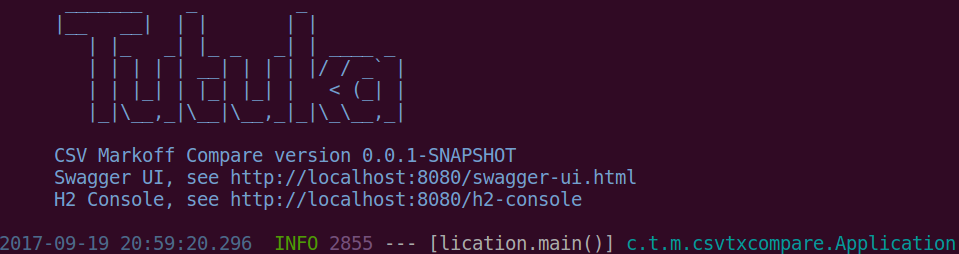
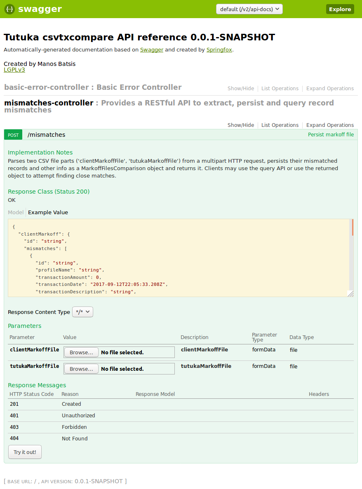
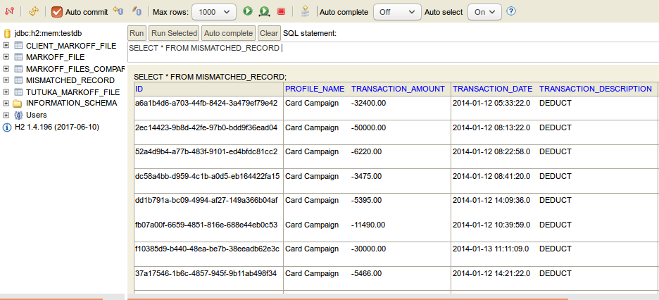

# CSV transaction files comparison [](https://travis-ci.org/manosbatsis/csvtxcompare)

Implementation of trial project for CSV transaction markoff files comparison

<!-- TOC depthFrom:2 depthTo:6 withLinks:1 updateOnSave:1 orderedList:0 -->

- [Notes On...](#notes-on)
	- [Assumptions](#assumptions)
	- [Architecture](#architecture)
		- [Frontend](#frontend)
		- [Backend](#backend)
- [HOWTO](#howto)
	- [Build and Run](#build-and-run)
	- [Testing](#testing)
	- [REST API Documentation](#rest-api-documentation)
	- [Database Console](#database-console)
- [UI Screenshots](#ui-screenshots)

<!-- /TOC -->

## Notes

This section includes some informative items regarding the codebase.

### Assumptions

- The mockups are loosely followed in many ways, e.g. bootstrapo cards are used VS HTML fieldsets and an additional report is provided to demonstrate the logic between the suggested matches.
- Comma is assumed to be the CSV field delimiter
- Date strings, when present, are always given as `yyyy-MM-dd HH:mm:ss`
- Field values are already normalized/regular as string representations of their typed values
- Non-unique records may exist, those are allowed in case they are useful as close (mis)matches
- All possible matches are calculated by comparing records field-by-field for plain equality. The only exception is the record number, as that allows some points within a threshold relevant to any unbalanced records in either side.
- Close matches are avaluated field-by-field, the code does not try to recover misplaced values
- The (integration) tests assume the sample files have 306/18 and 305/17 records/mismatches for the client and tutuka markoffs respectively. The files are in [src/main/resources/static](src/main/resources/static) 

### Architecture

#### Frontend

The font-end is a simple ember-based SPA, loosely following the mockup. The SPA also adds a comparison table component where client and tutuka
markoffs are given the x and y axis respectively. The table cells show the overall match score between the records and
provide a tooltip for visual comparison (pending)

The client UI project can be found in [src/main/web](src/mainweb). The build is mainly based on NPM. Main components: 

- [src/main/web/app/models/comparison.js](src/main/web/app/models/comparison.js) the leading entity model, also features computed properties used for cclose match suggestions 
- [src/main/web/app/components](src/main/web/app/components) UI components providinge the main UI widjets
- [src/main/web/app/templates](src/main/web/app/templates) handlebars templates

The client UI's dist folder is included in the Spring app for it to serve the corresponding resources. 

#### Backend

The project is a vanilla 3 tier (Controller, Service, Repository), RESTful Spring app without my usual model-driven
libs. An embedded, in-memory H2 database is used for convenience and can be replaced by any other mainstream RDBMS without
code changes.

The main components are: 

- [ComparisonsController](src/main/java/com/tutuka/manosbatsis/csvtxcompare/controller/ComparisonsController.java) provides a RESTful API to extract, persist and query markoff file comparisons. In case of any error, an ErrorModel object is provided as the JSON response. Documentation on the relevant endpoints is available in the [REST API Documentation](#rest-api-documentation) 
- [MarkoffFilesComparisonService](src/main/java/com/tutuka/manosbatsis/csvtxcompare/service/MarkoffFilesComparisonService.java) is the business component for persisting and quering the relevant data models
- [Util](src/main/java/com/tutuka/manosbatsis/csvtxcompare/Util.java) is a utility class used for type conversion and mismatch discovery


## HOWTO

This section includes some quick guides for common dev tasks and resources.

### Build and Run

1) Clone the source:

```
git clone https://github.com/manosbatsis/csvtxcompare.git
```

2) Navigate to the project folder

```
cd csvtxcompare
```

3) Build and run

```
mvn clean install spring-boot:run
```



4) Browse the app at [http://localhost:8080](http://localhost:8080) (TBA)

### Testing

(Integration) Tests are skipped by default. To enable them, build using the `ci` profile:

```
mvn clean install -P ci
```

This will build the code, launch a tomcat server and execute the tests against it.


### REST API Documentation

To view the API documentation run the application and browse to
[http://localhost:8080/swagger-ui.html](http://localhost:8080/swagger-ui.html) to visit the
embedded Swagger UI:



### Database Console

To review the database run the application and browse to
[http://localhost:8080/h2-console](http://localhost:8080/h2-console) to visit the
embedded H2 console. In the login screen, just leave everything as-is and submit:




## Walkthrough

This section walks you provides a UI and source walkthrough, showing screenshots and explaining the code for each use-case.
